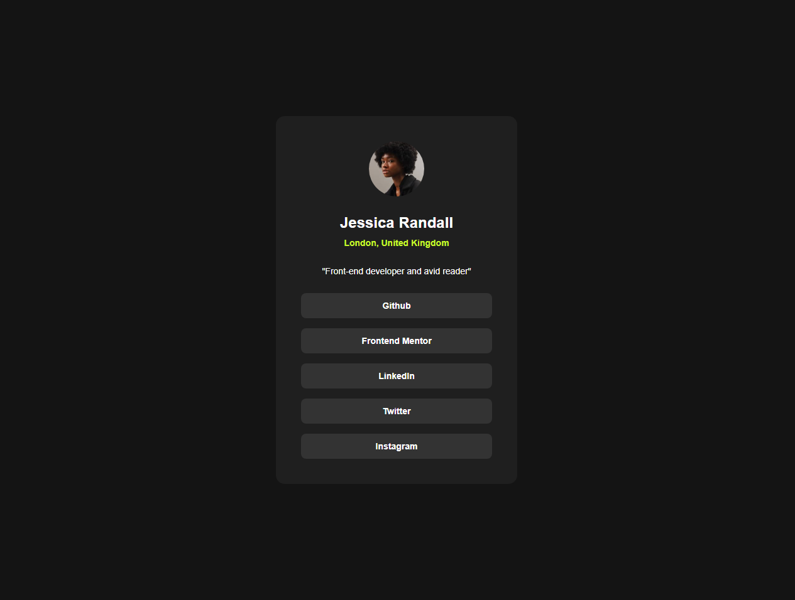

# Social Profile Links


> This is a solution to the "Social links profile" challenge on [Frontend Mentor](https://www.frontendmentor.io/challenges/social-links-profile-challenge-beTlGkQsQT). The goal was to build a component that is visually as close as possible to the proposed design, focusing on fundamental HTML and CSS skills, and mastering responsive layout.

<br>

**🚀 [View Live Demo](https://social-links-profile-puce-one.vercel.app/)**

<br>

### 🖥️ Screenshot



---

### 📋 Table of Contents

* [The Challenge](#-the-challenge)
* [Tech Stack](#-tech-stack)
* [What I Learned](#-what-i-learned)
* [How to View](#-how-to-view)
* [Author](#-author)

---

### 🚀 The Challenge

The challenge was to build a social links profile card component and get it looking as close to the design as possible. This involved:
* Structuring the content with **semantic HTML**.
* Recreating a responsive layout with specific attention to **spacing, typography**, and the card's visual design.
* Implementing interactive **hover and focus states** for the navigation links.
* Ensuring the component adapts correctly across different screen sizes.

---

### 🛠️ Tech Stack

The following tools and technologies were used in the construction of this project:

* **HTML5:** For structure and content semantics, including the appropriate use of `<main>`, `<article>`, and `<nav>`.
* **CSS3:** For styling, layout, and design.
    * **Local Fonts (`@font-face`):** For greater control over typography by loading font files directly and ensuring better performance with `font-display: swap;`.
    * **CSS Custom Properties (Variables):** To maintain a cleaner, more reusable, and scalable codebase for colors, spacing, and font sizes.
    * **Flexbox:** Used extensively for internal component layout (`.card` children) and for creating flexible, responsive sections.
    * **CSS Grid:** Utilized for efficient and robust **centering of the main component on the page**, demonstrating a modern layout approach.
    * **CSS `min()` function:** Applied to control the responsiveness of the card's width, ensuring it takes up 100% of available space on smaller screens while limiting its maximum size on larger displays.
    * **`box-sizing: border-box`:** Crucial for predictable sizing calculations, simplifying the layout process by including padding and border within the element's defined width and height.

---

### 📖 What I Learned

This project was a significant opportunity to consolidate foundational skills and delve deeper into advanced CSS techniques, particularly around layout and responsiveness.

* **Robust Centering with CSS Grid (`place-items: center`):** I gained a deeper understanding of using `display: grid` combined with `place-items: center` on the `body` (or a main container) for a highly effective and concise method of centering elements both horizontally and vertically on the screen. This is a powerful and modern layout pattern.

* **Strategic Layout with `<main>` as a Container:** I refined my approach to layout by shifting the primary centering and dimensioning properties from the `body` to the `<main>` element. This demonstrated the importance of **separating global body styles from main content layout**, leading to more modular, scalable, and predictable CSS, especially when dealing with complex nested elements. This was key to resolving unexpected sizing issues.

* **Modern Responsive Sizing with `min()`:** I successfully implemented `width: min(100%, 38.4rem)` on the card. This advanced CSS function provides a superior way to manage responsiveness, allowing the element to be fluid up to a maximum desirable size, preventing overflow on small screens and excessive stretching on large ones.

* **Optimizing Font Loading (`font-display: swap`):** I integrated `font-display: swap` into the `@font-face` rules. This technique significantly improves perceived page load performance by displaying fallback text while custom fonts are loading, enhancing the user experience by avoiding invisible text (FOIT).

* **Interactive States (`:hover`, `:focus-visible`):** I meticulously implemented `:hover` and `:focus-visible` states for interactive elements, ensuring not only visual feedback but also improved **accessibility** for users navigating via keyboard.

* **Semantic HTML and Accessibility:** I reinforced the use of semantic HTML tags like `<main>`, `<article>`, `<nav>`, and `<a>` to create a well-structured and accessible document outline, which benefits both search engines and assistive technologies.

---

### 📂 How to View

You can view the final result online or, if you prefer, clone the repository to explore the code on your machine.

**Option 1: Live Demo (Recommended)**

The easiest way to see the project in action is by accessing the deploy link:

👉 **[Access the live demo](https://social-links-profile-puce-one.vercel.app/)**

---

**Option 2: Running Locally**

If you want to explore the source code, follow these steps:

```bash
# 1. Clone this repository (change 'your-user' and 'repository-name')
git clone [https://github.com/WhatsIgorDoing/social-links-profile.git](hhttps://github.com/WhatsIgorDoing/social-links-profile.git)

# 2. Navigate to the project folder
cd social-profile-links

# 3. Open the index.html file in your browser
```

---

### 👨‍💻 Author

Project developed by **Igor Bueno**.

[](https://www.linkedin.com/in/engigorbueno/)
[](https://github.com/WhatsIgorDoing)